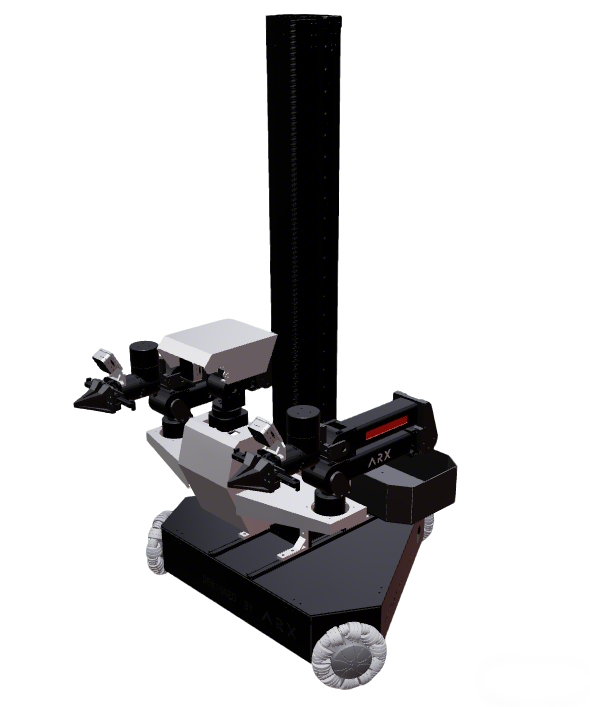
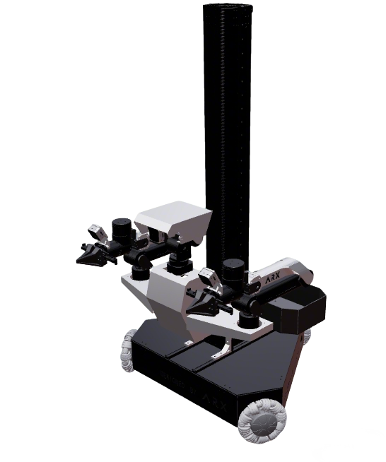
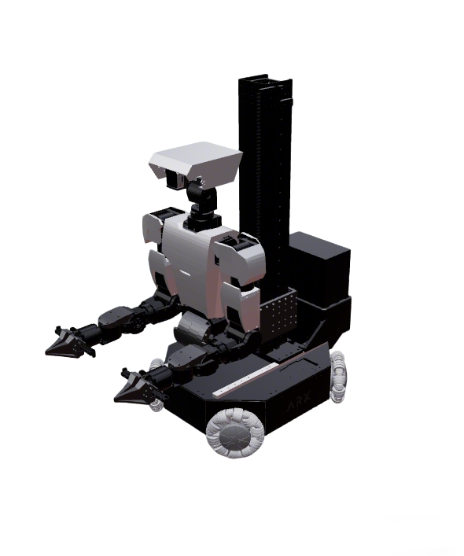
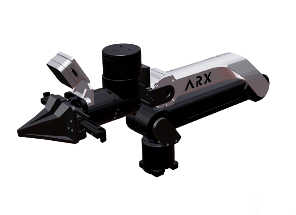
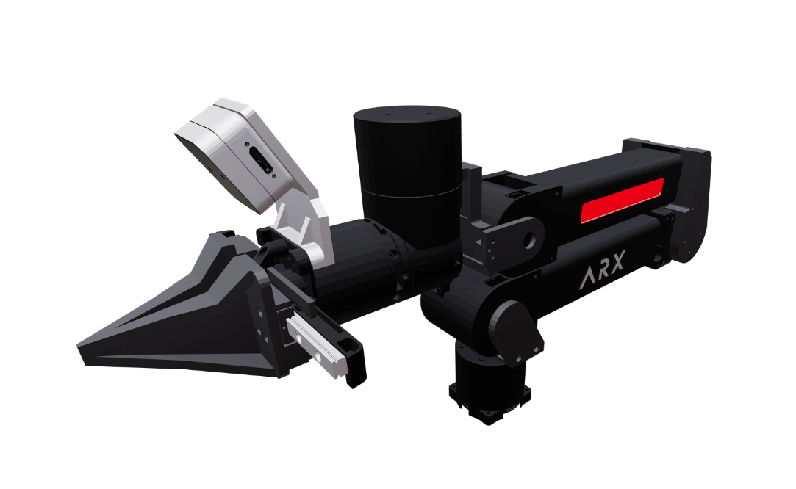
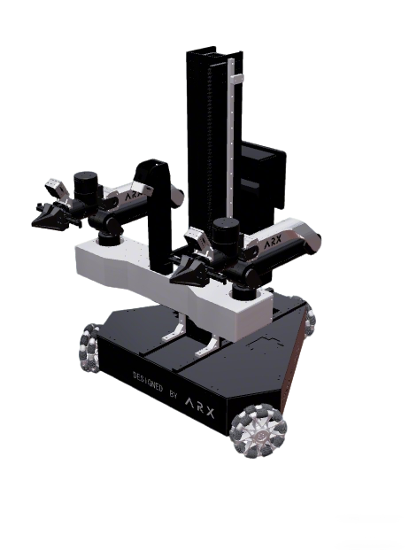
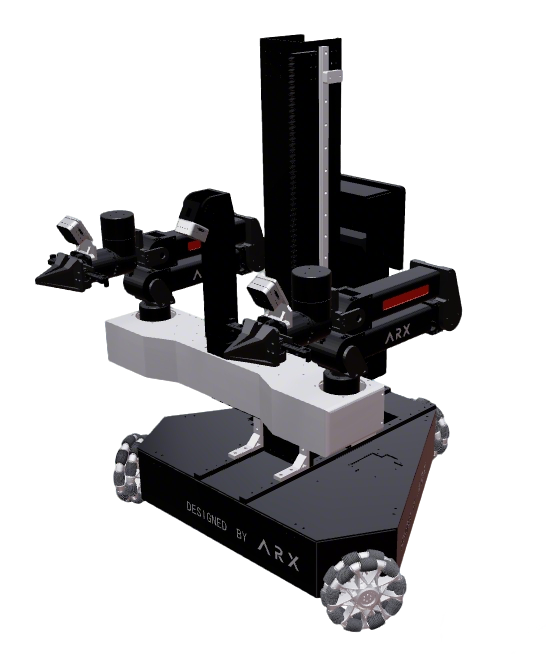

## ARX Robots

| Brand | Model                                      | Repaint | Images                                                                                                                                                                                                          |
|-------|--------------------------------------------|---------|-----------------------------------------------------------------------------------------------------------------------------------------------------------------------------------------------------------------|
| ARX   | [LIFT](arx_lift_description/)              | Yes     |                |
| ARX   | [X7S](arx_x7s_description/)                | Yes     |                                                                                                                                                                      |
| ARX   | [X5/R5](arx5_description/)                 | Yes     |                                                                                                                             |
| ARX   | [AC One](arx_acone_description/)           | Yes     | Dual-arm torso (split-body planning for Lift2S)                                                                                                                                                                  |
| ARX   | [LIFT2S](arx_lift2s_description/)          | Yes     |       |
